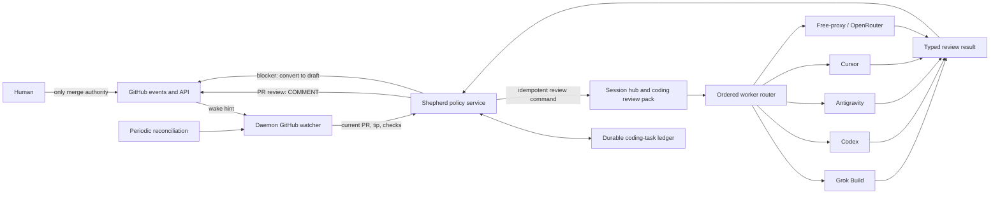

# Daemon-native pull-request review kickoff

**Status**: proposed after PR #243. This plan is for review and approval. It does not authorize
product implementation.

## Decision

Run pull-request review kickoff in the homelab Liberado daemon. Extend the existing shepherd and
coding-task control plane. Do not add another orchestrator.

The daemon watches a configured set of GitHub repositories. A `ready_for_review` transition arms
the current PR tip. A review starts only after GitHub reports the configured required checks as
successful for that exact tip SHA. GitHub events are wake-up hints. Before every action, Liberado
reads current GitHub state again.

The production worker order is fixed by policy:

1. Grok Build
2. Codex
3. Antigravity (`agy`)
4. Cursor
5. the existing free-proxy/OpenRouter router

A worker can fall through only for a typed availability result, such as `usage_exhausted`,
`not_headless`, or `temporarily_unavailable`. A review defect is not a reason to try another
worker. The last route accepts only models that the free-proxy proves are zero price. Unknown
pricing fails closed.

The result is a GitHub pull-request review with event `COMMENT`. On a code blocker, Liberado posts
a tip-pinned checklist and then converts the PR to draft. It never approves, requests changes, or
merges through this path. Human merge remains the hard gate.

## Problem

Grok Bot currently combines a GitHub listener, readiness policy, harness selection, and review
side effects. This spends Grok Bot capacity on coordination that Liberado already owns in part.
It also leaves operational state outside the daemon task ledger.

PR #243 showed why a push-driven review rule is too expensive. A review on each new commit spends
tokens while the author is still working. The useful boundary is explicit: the author marks a PR
ready, and CI is green on the same tip. A blocker sends the PR back to draft. Later pushes do not
start reviews. The author must mark the repaired tip ready again.

Moving kickoff into Liberado gives one restart-safe policy owner, one task history, and automatic
worker fallback. Grok Bot stays available as an operator escape hatch, but it is no longer the
normal PR-review controller.

## Ownership and target architecture

The current architecture already has the needed owners:

- Shepherd owns GitHub observation, PR policy, admission, and ready/blocked decisions.
- The coding-task ledger owns durable PR, revision, command, run, and evidence facts.
- The session hub and coding pack own background goal execution and the review workspace.
- `WorkerPort` adapters own one harness process. They do not own fallback policy.
- The free-proxy owns proof that an API model is free and failover among free model endpoints.

The current `liberado shepherd` CLI has the policy loop. Make that policy a daemon-hosted service
and keep the CLI as an operator client or one-shot diagnostic command. Do not run an independent
daemon watcher and the old shepherd loop against the same repository.

The first observer is GitHub-specific because ready, check-suite, and COMMENT-review semantics are
GitHub contracts. Keep GitHub access behind a narrow forge-observation/publication port so a later
Gitea adapter can supply equivalent normalized facts. Do not route this through the historical
Gitea repository-creation path or the face-agent `delegate` tool. Those paths do not own PR review
eligibility, task identity, or GitHub review publication.



### One controller per PR

Use the existing controller lease. A repository in daemon-native mode uses
`liberado-shepherd`. Grok Bot may observe it, but must not dispatch, post the automated review, or
change draft state. An explicit operator escape-hatch command must still enter the Liberado task
ledger, or it must first transfer the controller lease. Never let both controllers act on one tip.

## Configuration

Keep repository and trigger policy in `topology.toml`. Keep worker process settings and model
selection in coder tuning, where the current control-plane worker registry lives. Keep secret
values outside TOML. Configuration contains secret references only.

Suggested shape:

```toml
[github_pr_review]
enabled = true
delivery = "hybrid"                 # poll | webhook | hybrid
poll_seconds = 120
reconcile_on_start = true
max_concurrent_reviews = 1

[[github_pr_review.repositories]]
name = "personal-project"
repository = "OWNER/REPOSITORY"
coding_project = "personal-project"
base_branch = "main"
profile = "coding-review-unattended"
controller = "liberado-shepherd"
auth = "github-homelab"
required_checks = ["CI", "CRAP regression"]
gate = "ready_and_green_tip"
review_event = "COMMENT"
blocker_action = "draft"
harness_order = ["grok-build", "codex", "antigravity", "cursor", "free-router"]

[[github_pr_review.auth]]
name = "github-homelab"
kind = "token"                      # first slice; GitHub App can follow
token_ref = "LIBERADO_GITHUB_TOKEN"
webhook_secret_ref = "LIBERADO_GITHUB_WEBHOOK_SECRET"
expected_login = "ForrestThump"

[tuning.coder.control_plane.review_workers.grok-build]
kind = "grok_build"
executable = "/home/box/.local/bin/grok"

[tuning.coder.control_plane.review_workers.codex]
kind = "codex"
executable = "/home/box/.local/bin/codex"
output = "jsonl"

[tuning.coder.control_plane.review_workers.antigravity]
kind = "antigravity"
executable = "/home/box/.local/bin/agy"
output = "stream-json"

[tuning.coder.control_plane.review_workers.cursor]
kind = "cursor"
executable = "/home/box/.local/bin/agent"
output = "stream-json"

[tuning.coder.control_plane.review_workers.free-router]
kind = "openai_compatible"
base_url = "http://127.0.0.1:PORT/v1"
model = "auto"
pricing_policy = "zero_only"
```

This is a proposed vocabulary, not a claim that these fields exist. Extend
`ShepherdProjectConfig` instead of adding a separate repository registry if the same repository is
already shepherded. One configuration row must be the source for repair and review policy.

Validation must reject:

- a repository value that is not `OWNER/REPOSITORY`;
- duplicate repository rows or worker IDs;
- `COMMENT` replaced by `APPROVE` or `REQUEST_CHANGES` in this feature;
- an empty required-check list unless an explicit `all_reported_checks = true` policy is set;
- a worker in `harness_order` with no adapter;
- `free-router` without `pricing_policy = "zero_only"`;
- a secret value embedded in configuration instead of a secret reference;
- two enabled controllers for the same repository.

Start with a fine-grained token because it is the smallest slice. It needs read access to pull
requests, metadata, commits, and checks, plus write access to pull requests. Record the token's
resolved GitHub login at daemon start and with each submitted review. A GitHub App is the preferred
later form for several owners or organizations because installation scope is explicit. Never put
credentials, raw GitHub payloads containing credentials, or CLI auth stores into model context.

## Eligibility and event mapping

Eligibility is a conjunction over current GitHub state, not an event name:

```text
configured repository
AND PR is open
AND PR is not draft
AND this tip was armed by ready_for_review (or an explicit escape hatch)
AND current head SHA equals the armed SHA
AND every configured required check is complete and successful on that SHA
AND no accepted review result exists for that repository + PR + SHA
AND the Liberado controller lease is held
```

`neutral`, `skipped`, or an absent required check is not success unless repository policy names
that conclusion as acceptable. A branch-level green result is not enough. Query check runs and
status contexts for the exact pull-request head SHA. Re-read the head immediately before dispatch,
before posting, and before changing draft state.

| GitHub signal | Meaning | Daemon action |
|---|---|---|
| `pull_request.ready_for_review` | Arms the event's head SHA. | Persist the observation, fetch current PR and tip checks, then evaluate eligibility. |
| `check_suite.completed` | CI may now be settled. | Find open configured PRs whose head SHA equals the suite SHA; re-query the full configured check set. |
| `check_run.completed` | One required check may have settled. | Coalesce by repository and SHA, then re-query the full check set. Do not trust this one run as the whole gate. |
| `pull_request.review_requested` | Wake hint and compatibility signal. | Re-query eligibility. It does not bypass draft, ready, SHA, CI, or idempotency gates. |
| `pull_request.synchronize` | The tip changed. | Record the new head, cancel or supersede stale dispatch, and leave it unarmed. Do not review the push. |
| `pull_request.converted_to_draft` | Work resumed or Liberado found blockers. | Disarm the current cycle. Preserve the completed review evidence. |
| `pull_request.closed` | Work ended. | Mark the task closed and cancel in-flight review work. Never merge. |

GitHub webhook delivery is not durable enough to be the only source. Use `hybrid` in normal
operation: a GitHub-specific webhook endpoint gives low latency, and bounded polling repairs lost,
duplicated, or reordered events. Polling is sufficient for the first production slice.

Do not send GitHub payloads through the current generic `POST /api/hooks/{name}` contract. That
endpoint uses a Liberado shared-secret header and an in-memory ten-minute duplicate cache. A
GitHub receiver must verify GitHub's signature against the raw body, bound the payload size,
allow only configured repositories and event types, persist the GitHub delivery ID, and return
quickly. Both webhook and poll paths then call the same shepherd observation function.

On boot and after webhook overflow or API failure, reconcile a bounded page of open PRs in every
configured repository. Reconciliation reads authoritative state and repairs the ledger. It must
not infer that an unseen ready transition occurred: an already-ready PR is eligible only if the
ledger has its ready arm, or if migration policy explicitly seeds it once.

## Production harness adapter contract

Do not reuse `harness-eval::HarnessAdapter`. That contract exists for controlled comparisons and
has different ordering and result policy. Extend the production `WorkerPort` seam, or add a
review-specific operation beside it in `coder-core` after one live adapter proves the shape.

Each adapter runs one review in a dedicated checkout pinned to `expected_head_sha`. The review
role is read-only. It may inspect code and run tests, but it must not commit, push, call `gh`, post
a review, change draft state, or merge. Shepherd alone performs GitHub writes.

Suggested semantic contract:

```rust
struct ReviewRunRequest {
    task_id: TaskId,
    run_id: RunId,
    repository: RepositoryId,
    pull_request: u64,
    expected_head_sha: CommitSha,
    base_sha: CommitSha,
    workspace: PathBuf,
    output_schema: PathBuf,
}

enum ReviewRunOutcome {
    Completed(StructuredReview),
    Unavailable(AvailabilityReason),
    Failed(WorkerFailure),
    Cancelled,
}

enum AvailabilityReason {
    UsageExhausted { retry_after: Option<DateTime<Utc>>, evidence: SignalRef },
    AuthenticationRequired,
    NotHeadless,
    TemporarilyUnavailable { retry_after: Option<Duration> },
    ExecutableMissing,
}

struct StructuredReview {
    reviewed_head_sha: CommitSha,
    findings: Vec<ReviewFinding>,
    summary: String,
}

struct ReviewFinding {
    id: String,
    severity: Severity,
    blocking: bool,
    path: String,
    line: Option<u32>,
    title: String,
    explanation: String,
    suggested_check: Option<String>,
}
```

The adapter stores raw stdout, stderr, and structured events as capped artifacts outside the task
ledger. It returns an artifact digest and a short evidence reference. The adapter must validate
the final JSON against the schema and reject a result whose `reviewed_head_sha` differs from the
request. Exit code zero without a valid result is `Failed`, not approval. A timeout, malformed
output, permission denial, or model error is not `usage_exhausted` unless a harness-specific
classifier proves it.

### Usage-exhausted detection matrix

The common classifier consumes a typed HTTP/API error when available, the process exit status,
and parsed structured output. It may use exact, versioned message markers only as a last resort.
Every marker needs a captured fixture. Broad substring rules such as `contains("quota")` are not
safe enough to trigger fallback.

| Adapter | Preferred signal | Temporary/unavailable signal | Required treatment |
|---|---|---|---|
| Grok Build | Structured backend status `402` or a documented quota error code from machine output. | No supported non-interactive mode, startup pager, or login prompt becomes `NotHeadless` or `AuthenticationRequired`, not quota. | Current installed CLI must remain disabled by preflight until a bounded headless invocation and stable signal are proven. Then it keeps first place. |
| Codex | JSONL error event from `codex exec --json`; classify HTTP `402` or its explicit usage-limit code and capture reset time when present. | `429` without account exhaustion is temporary; auth and transport errors have separate classes. | Use `--output-schema` for the result. A small successful probe does not prove enough quota for a full review. Mid-run exhaustion falls through with the same task and fresh pinned workspace. |
| Antigravity (`agy`) | `--output-format stream-json` error object; classify a documented `RESOURCE_EXHAUSTED`, `429` quota reason, or account-limit code. | Headless permission auto-denial is `Failed` or `AuthenticationRequired`, not quota. A print timeout is temporary only when no work remains active. | Use `--json-schema`. Preserve the conversation ID only as adapter state; fallback reconstructs from task and Git state. |
| Cursor | `--print --output-format stream-json` error object with a documented plan/usage-limit code; use HTTP `402` only when the event ties it to usage. | `429` service rate limit, auth failure, or a server error stays distinct. | Do not infer exhaustion from a generic nonzero exit. Local and cloud-agent modes need separate adapter IDs because their lifecycle and billing signals differ. |
| Free-proxy / OpenRouter | HTTP response is authoritative. `402`, `429`, provider quota codes, timeout, and candidate-scoped failures already drive free-model failover. Catalog pricing must parse to zero; quota-then-pay providers require known positive free quota. | Exhaustion of all ranked free candidates returns `Unavailable`, with per-candidate evidence and retry hints where supplied. | This is the final harness, not a silent paid escape. Unknown or nonzero pricing is refused. Never substitute a paid model when the free set is empty. |

For each adapter, freeze a small conformance corpus: success, usage exhausted, rate limited,
authentication failed, permission denied, timeout, malformed output, and ordinary model failure.
Run these fixtures without network access. Add a live opt-in smoke test for each installed CLI.
An adapter cannot join the production order until all classifications pass and an unattended run
has completed on the homelab.

The ordered router records `WorkerUnavailable` for each skipped worker and `WorkerRunStarted` for
each real launch. It does not spend a normal retry on a worker whose cooldown is still active.
Cooldown state is durable and has a source and expiry. Unknown expiry gets a bounded operator-set
probe interval. Successful use clears stale cooldown state.

## Review publication and blocker action

The worker returns findings. Shepherd renders and publishes them. This keeps GitHub credentials
away from foreign CLIs and gives every adapter the same output.

Use the GitHub pull-request review API with event `COMMENT`, not a plain issue comment. Include:

- the exact reviewed tip SHA;
- the harness ID and Liberado run ID;
- the authenticated GitHub login that submitted the review;
- a concise summary;
- ordered findings with file and line citations;
- a machine marker such as `<!-- liberado-review:OWNER/REPO#N@SHA -->`;
- when blockers exist, a checklist pinned to that SHA.

The author identity may be unable to approve or request changes on its own PR. `COMMENT` is the
portable first contract. Authentication identity is evidence, not decoration: resolve it at boot,
compare it with `expected_login`, and fail closed on mismatch unless configuration explicitly
permits that login.

Publication is a small saga because GitHub does not atomically post a review and convert a PR to
draft:

1. Re-read the PR and require `head_sha == reviewed_head_sha` and `draft == false`.
2. Create or find the COMMENT review by its machine marker.
3. Record the GitHub review ID in the ledger.
4. If the structured result contains a code blocker, re-read the head again and convert the PR to
   draft.
5. Record the draft transition. If it fails, retry only that transition; do not post a second
   review.

If the head changes before publication, record the run as stale and publish nothing. If it changes
after the comment but before draft conversion, do not draft the new tip. Notify the operator and
leave the review visibly pinned to the old SHA.

Checklist identity must use stable finding IDs. A later review creates a new tip section. Do not
edit an old review to imply that it covered new code.

## Idempotency and restart safety

The durable key for the normal path is:

```text
review_key = repository_id + pull_request_number + head_sha + policy_version
```

`policy_version` changes only when the review contract changes enough to justify a new review.
It is not a retry counter. A manual escape hatch uses a separate explicit command ID and records
who requested it.

Persist these separate facts in the existing repository-scoped coding-task ledger:

- ready observation and armed SHA;
- head revisions and supersession;
- CI observations with check IDs, attempts, conclusions, and observed SHA;
- review command ID and expected SHA;
- every worker admission, cooldown, run, and terminal classification;
- structured result artifact digest;
- GitHub review ID and submitting login;
- draft conversion result;
- cancellation, stale result, and operator escape-hatch facts.

Use the existing command-id duplicate guard and one-writer ledger behavior. The daemon obtains a
repository-scoped lease before dispatch. A restart folds the ledger, re-reads GitHub, and resumes
the next incomplete side effect. It never decides from a label, branch name, pending-review file,
or process table alone.

The GitHub delivery ID deduplicates webhook ingestion. It is not the review idempotency key.
Polling has no delivery ID and emits stable observation keys from repository ID, PR number, SHA,
check run ID, attempt, and conclusion. Duplicate wake signals are normal.

Only one review can be in flight for a review key. If the tip changes, request cancellation and
mark the run superseded. A late worker result stays in history but cannot post or change the PR.

## Interaction with shepherd and the Slice 2+ control plane

This plan builds on landed control-plane slices 0–2:

- Reuse `shepherd_task_id`, the controller lease, orthogonal CI/review evidence, command IDs,
  durable task roots, and crash-safe ledger projection.
- Reuse the daemon goal service and session pack for execution. A review is a background coding
  session with a review profile and a pinned worktree.
- Keep policy in shepherd. `ControlPlaneSupervisor` executes one requested worker run. It must not
  decide when a PR is eligible, how many reviews to run, or which PR action follows.
- Add structured review results before treating a successful goal as an accepted review. The
  current shepherd code maps `succeeded` directly to `ReviewApproved`; that is too weak and must
  not be reused for this feature.
- Add native-run ledger parity when native review execution is enabled. Do not force the async
  native backend behind the current synchronous `WorkerPort` only for type uniformity.
- Replace pending-review files and `shepherd:review-N` labels as authorities. They can remain
  temporary compatibility projections during migration.

This review flow differs from the current shepherd cold-review flow. The current prompt can fix,
commit, and push findings. The daemon-native PR Reviewer must be read-only and publish findings.
The author or a later repair task fixes them. This separation is needed for a credible independent
review and for safe fallback across foreign harnesses.

## Ordered implementation slices

Each slice must keep new functions below the CRAP ceiling and must pass the normal module-health
ratchet. No slice may raise a baseline or add a weak waiver.

### Slice 0 — Freeze policy and adapter evidence

Document the production review result schema, availability taxonomy, GitHub permission set, and
per-harness invocation. Capture redacted fixtures from the installed Grok, Codex, Antigravity,
Cursor, and free-router paths. Decide the checklist and ready-arm questions below.

Acceptance tests:

- Schema fixtures reject an absent or mismatched reviewed SHA and an unclassified success.
- Every adapter corpus separates usage exhaustion from auth, permission, timeout, and model
  failure.
- A configuration example contains no repository-specific constant in code and no secret value.
- A live manual smoke records which harnesses can run unattended; failure does not enable a loose
  text matcher.

### Slice 1 — Daemon polling observer, ledger only

Extract shepherd's repository observation and policy transition code so the daemon can host it.
Add multi-repository configuration and bounded startup/poll reconciliation. Record ready arms,
tips, required-check evidence, and closed/draft transitions. Do not dispatch or write GitHub.

Acceptance tests:

- Two fixture repositories with different required checks never share state or credentials.
- A ready event on SHA A plus green CI on SHA B is ineligible.
- A push to an armed PR supersedes SHA A and does not arm SHA B.
- Red, pending, missing, neutral, and skipped required checks fail closed by default.
- Repeated polls and daemon restarts produce one logical ready observation and no command.
- `liberado shepherd --dry-run` and the daemon use the same pure eligibility function.

### Slice 2 — One pinned, read-only review through Codex

Issue one stable review command after eligibility. Run the Codex adapter through the daemon
session/coding-task path in a dedicated checkout. Return a schema-validated `StructuredReview`.
Do not write GitHub yet. Codex is the first implementation adapter because the installed CLI has
headless JSONL and output-schema support. This does not change the final order; unimplemented or
disabled earlier adapters report `Unavailable`.

Acceptance tests:

- A crash after command creation starts at most one run after restart.
- The checkout HEAD and returned `reviewed_head_sha` must equal the armed SHA.
- The adapter cannot push, call GitHub, or write outside its workspace.
- A zero exit with malformed output is failure, not a clean review.
- A mid-run usage-limit fixture records cooldown and returns `UsageExhausted`.
- A changed PR tip makes the result stale and causes no external write.

### Slice 3 — COMMENT publication and blocker-to-draft saga

Render one GitHub COMMENT review from `StructuredReview`. Record the submitting identity and
GitHub review ID. For blockers, post the tip-pinned checklist and convert the still-matching tip to
draft. Do not dispatch repairs and do not merge.

Acceptance tests:

- No findings and non-blocking findings both submit `COMMENT`, never `APPROVE`.
- A blocker creates one marked checklist and converts only the reviewed tip to draft.
- A failure between comment and draft conversion retries draft conversion without a second
  comment.
- A head change at either guard point prevents action on the new tip.
- An auth-login mismatch fails before publication.
- No code path calls a merge endpoint or enables auto-merge.

### Slice 4 — Ordered fallback and durable quota cooldowns

Add Grok Build, Antigravity, Cursor-local, and free-router adapters. Enable each only after its
fixture corpus and live unattended smoke pass. Put ordered selection in shepherd policy. Keep
adapter execution in the control plane. A normal review failure stops and alerts; only typed
unavailability falls through.

Acceptance tests:

- The deterministic sequence is Grok Build, Codex, Antigravity, Cursor, free-router.
- A 402/typed exhausted result starts the next adapter once and records both facts.
- Auth failure, malformed review, and ordinary nonzero exit do not masquerade as quota.
- Restart during fallback resumes from the first unfinished eligible adapter.
- A durable cooldown prevents repeated full probes before reset and expires at the recorded time.
- With no free catalog candidate, the final adapter fails closed and makes no metered request.
- A zero-priced candidate that returns 429 falls through only inside the free-proxy's bounded
  free-model walk.

### Slice 5 — GitHub webhook accelerator

Add a narrow GitHub webhook receiver with raw-body signature verification, delivery-ID
deduplication, repository allowlisting, and bounded payloads. It calls the same observation seam as
polling. Keep periodic reconciliation enabled.

Acceptance tests:

- Invalid signatures, unknown repositories, unsupported events, and oversized bodies are refused.
- Duplicate and reordered ready/check events converge to one review key.
- `ready_for_review`, `check_suite`, `check_run`, and `review_requested` all wake the same evaluator
  but cannot bypass its gates.
- A dropped webhook is repaired by polling.
- Webhook response does not wait for a review run.

### Slice 6 — Migration and operator controls

Enable one configured repository in shadow mode, then daemon-native mode. Add status output for
armed tips, CI blockers, active harness, cooldowns, review publication, and draft action. Retire
the matching Grok Bot review hooks only after live evidence.

Acceptance tests:

- Shadow mode records the same eligible tip as the existing automation and performs no write.
- Controller-lease conflict stops one controller before dispatch.
- A full live cycle survives daemon restart and produces one COMMENT review.
- A blocker cycle returns the PR to draft; a push alone does not review; a new ready transition on
  a green new tip produces one new review.
- Disabling the feature stops new admissions but preserves and reports task history.

## Risks and controls

| Risk | Control |
|---|---|
| Duplicate reviews from webhook and polling | One review key, stable command ID, GitHub marker lookup, durable review ID. |
| Review of stale code | Pin workspace and result to SHA; re-read head before dispatch and each GitHub write. |
| False quota classification | Typed signals first, exact versioned fixtures second, never generic stderr or exit code alone. |
| Foreign CLI writes or pushes | Dedicated read-only review workspace, no GitHub credentials in worker environment, shepherd owns all forge writes. |
| Silent paid API use | Free-proxy zero-price catalog, known-quota rule for quota-then-pay providers, no paid fallback. |
| Wrong GitHub identity | Resolve login at boot, compare with configuration, record login with publication. |
| Event loss or order inversion | Events only wake; periodic reconciliation reads authoritative GitHub state. |
| Dual control with Grok Bot | Existing controller lease and per-repository cutover. |
| Grok Build cannot run headless | Keep it first in policy but unavailable by explicit preflight until proven. Do not hang the queue. |
| Review output is a rubber stamp | Required structured SHA and findings schema, code citations, malformed/empty-contract failure, COMMENT-only publication. |
| Module-health regression | Small slices, mutation checks for claimed gates, normal CRAP ratchet; never raise baselines. |

## Non-goals

- Auto-merge, merge queues, branch-protection changes, or approval authority.
- Review on every push.
- Automatic implementation of review findings in this path.
- Replacing the session hub, coding pack, task ledger, shepherd policy owner, or free-proxy.
- Reusing comparison scheduling or C3 `HarnessAdapter` as production policy.
- Preserving one conversation across different harnesses. Continuity is task state plus Git state.
- A general GitHub automation engine or support for every forge in the first slices.
- A paid emergency route. A separate future policy would need explicit operator approval.

## Migration from Grok Bot

1. Add repository configuration with `controller = "grok-bot"` and run daemon observation in
   shadow mode.
2. Compare eligible-tip decisions and required-check evidence for several ready cycles.
3. Stop the Grok Bot PR Reviewer webhook/listener for that repository.
4. Transfer the controller lease to `liberado-shepherd`.
5. Enable daemon publication for one repository and retain Grok Bot only as a manual escape hatch.
6. After restart, quota, stale-tip, and blocker cycles pass in production, remove the retired Grok
   Bot review hook. Keep its configuration recoverable for rollback, but never active in parallel.

The draft-on-open routine can remain outside this project during migration. The review path only
requires that ready events arm work and blocker findings return the matching tip to draft.

## Open questions for Forrest

- [ ] **A — Checklist format (recommended):** Put GitHub task checkboxes for blocking findings in
  the COMMENT review body, under a heading pinned to the full tip SHA. Non-blockers use bullets.
  **B:** Use bullets only and let the author track completion elsewhere.
- [ ] **A — Ready arming (recommended):** `ready_for_review` alone arms the tip. A
  `review_requested` event is a wake hint and escape-hatch carrier, not a second required gesture.
  **B:** Require both ready and a review request for every automatic cycle, matching the current
  Grok Bot listener limitation.
- [ ] **A — Required checks (recommended):** Require a non-empty explicit list per repository and
  fail closed when a named check is absent. **B:** Read GitHub branch-protection required contexts
  through an App/token that has enough access.
- [ ] **A — Authentication (recommended for Slice 1):** Start with one fine-grained token reference
  per credential profile, with resolved-login validation. **B:** Require a GitHub App before the
  first GitHub-writing slice.
- [ ] **A — Review freshness (recommended):** One normal review per tip and policy version. A manual
  repeat requires an audited escape-hatch command. **B:** Never permit a second review on the same
  tip.
- [ ] **A — Grok readiness (recommended):** Keep Grok first in declared order but skip it as
  `NotHeadless` until the installed CLI passes a live unattended conformance test. **B:** Block the
  whole review queue until Grok can run, preserving strict first-choice use at the cost of no
  fallback service.
