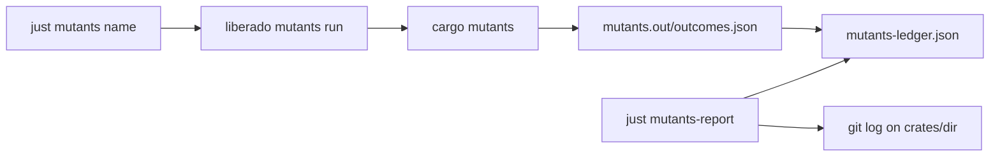

# Mutants campaign ledger — implementation plan

## Goal

Track `cargo mutants` campaigns per workspace crate without running mutants in CI. Give agents a
mechanical scoreboard — not markdown memory — for which crates have been mutated, at which commits,
and how much code drifted since the last full-package run.

## Architecture

### Three layers (do not merge)

| Layer | Path | Role |
|---|---|---|
| Ledger | `mutants-ledger.json` | Machine scoreboard: append-only campaigns |
| Evidence | `docs/validation/mutation-testing/*.md` | Human survivor triage (historical) |
| Raw output | `mutants.out/` (gitignored) | Ingest counts, discard |

## Ledger schema (`schema: 1`)

Append-only `campaigns` array. Each row is one completed `cargo mutants` run.

- **`scope: "package"`** — full crate run; resets the drift clock.
- **`scope: "file"`** — partial run; history only, does not reset clock.
- **`commit: null`** — markdown-era seed; crate is "historical only" until a real run appends a SHA row.
- **Squash workflow** — never edit prior rows. Re-run after adding tests; append the improved counts.

## CLI (`liberado mutants …`)

Implemented in `crates/cli/src/mutants_cmd.rs`. Crate inventory from `crate_map_cmd::list_crates`.

| Command | Behavior |
|---|---|
| `run <crate-dir>` | Run cargo-mutants with repo timeout flags, then `record` (even on non-zero exit) |
| `run --lib-only coder-agent` | Same with `-- --lib` profile for coder-agent |
| `record [crate-dir]` | Ingest `mutants.out/outcomes.json` into the ledger |
| `report [--all]` | Never campaigned / historical only / most drift |
| `next [--all]` | One crate name: never campaigned first, else highest drift |

Ingest reads top-level counts from `outcomes.json`: `caught`, `missed`, `timeout`, `unviable`,
`cargo_mutants_version`. `viable = caught + missed + timeout`.

## Justfile

Thin wrappers only — no logic in `justfile`:

- `just mutants <name>` → `liberado mutants run <name>`
- `just mutants-agent` → `liberado mutants run --lib-only coder-agent`
- `just mutants-record <name>` → `liberado mutants record <name>`
- `just mutants-report` / `just mutants-next`

Agent playbook: [`Skills/mutants-campaign.md`](../../Skills/mutants-campaign.md).

**Not** wired into `just ci`, `just preflight`, or `just ready`.

## Health report rules

1. Parse ledger; group by `package`, filter `scope == "package"`.
2. **Never campaigned** — zero such rows (compare against crate-map inventory).
3. **Historical only** — rows exist, none with a commit SHA.
4. **Most drift** — latest SHA-bearing row per crate; rank by `git rev-list --count <commit>..HEAD -- crates/<dir>`.
5. If commit not an ancestor of HEAD: print `commit not in this history` (no false count).

Skip `testing` and `tooling` roles by default; `--all` includes them.

## Initial seed

`mutants-ledger.json` seeds the 13 crates documented in
[`mutation-testing-plan.md`](../validation/mutation-testing-plan.md) with `commit: null`,
`source: "markdown-seed"`, and counts from the per-crate reports.

## Tests

- Ledger JSON round-trip and append semantics
- Ingest from fixture `outcomes.json`
- Report grouping (never / historical / drift)
- Drift when commit missing or not an ancestor (temp git repo)
- Repo-root `mutants-ledger.json` parses in `liberado-cli` integration test

## Out of scope (v1)

- CRAP-style ratchet on catch rate
- File-level scope tracking beyond recording `scope: "file"` on ingest
- CI mutation runs
- SQL or per-crate meta folders
