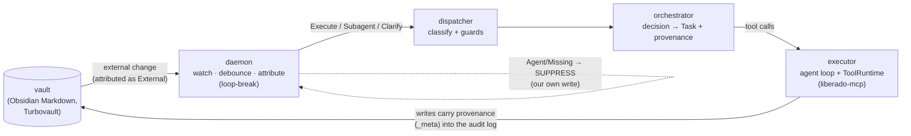

# Liberado — Architecture

Liberado is a **Rust-native personal AI Life OS**: a daemon that watches your Obsidian vault, reasons
about changes with an LLM, and acts on your behalf through tools — safely, and without reacting to its
own work. This document is the cold-start map. Each crate has its own zoomed-in
`crates/<name>/ARCHITECTURE.md`.

> **Before you change anything**, read [`failure-modes.md`](failure-modes.md). It is five pages on the
> five bugs this system produces repeatedly — every one of which shipped with a green test suite, and
> none of which was found by reading the code.

## Three pillars

For how these pillars position Liberado against the free alternatives, see
[Positioning](positioning.md).

1. **Modular MCP/hook substrate.** Loose-coupled components (perceive / decide / execute / store) that
   talk through events; capability is composed from optional crates. TurboVault is the default,
   privileged perception+storage plugin — not a hard dependency. Every crate aims to be independently
   useful.

2. **Safety is engineered, not prompted.** The LLM proposes; deterministic code disposes, only ever
   toward less autonomy. The capability/zone boundary is the actual trust boundary — and it is what
   makes self-extension safe: an agent can build new tools but can never widen its own authority. The
   default boundaries are MCPs and hooks: those are exactly how agents interact with real data, and
   they are the first and primary point of security and control for the user.

3. **Token efficiency via the dispatcher-as-tool-advisor.** Disjoint context; a compact catalog;
   tools surfaced on-demand, never dumped into context. This applies beyond tool definitions to
   context pollution in general — build everything asking: "are we adding more context than we need,
   too quickly, and can it be surfaced later instead so it stays useful?" The caveat matters: context
   is sometimes unexpectedly useful, so this can be taken too far in the conservative direction.
   Empirical testing finds the balance.

The **general agentic orchestration kernel** (goal sessions, verifiers, subagents, session/events) is
**built** — D7's unified Session model and the one converged execution engine (see
[`sessions.md`](sessions.md)). As of 2026-07-19 the **homelab daemon is live** (Telegram sticky chat,
OpenClaw briefings cut over, TurboVault peer with **vector search + tasks**). As of 2026-07-23
engineering hardened **module boundaries**, **MCP connection pooling** (default on), and a **partial
Tier-1 live conformance suite** (see [`../../roadmap.md`](../../roadmap.md)). Effort still
follows a deliberate **replacement priority**: **autonomous life-OS daemon → chat → coding** — the
remaining P1 gap is the **phone-grade interfacing loop** (session WebUI later; not Telegram multiplexing),
not storage
or basic MCP reach. The order and its rationale are in [`positioning.md`](positioning.md); the
concrete work items, in priority order, are in [`../../roadmap.md`](../../roadmap.md).
Coding is a **domain pack** on a domain-neutral kernel, not the product identity, and explicitly
*good-enough-and-integrated* rather than a Claude Code / Kilo rival. The coding pack is home-spun
Liberado (`Provider` + `Executor` + `ToolRuntime` + `coder-*`) — not a VTCode wrap. Surfaces (TUI,
WebUI, CLI, PR factory) are session clients; they do not own the loop. Architecture:
[`agentic-loops.md`](agentic-loops.md). Live ops status: [`../../project/handoff.md`](../../project/handoff.md).

**Operational data** (the runtime trace — Decision 12; conversation history — Decision 17)
deliberately lives *outside* the vault as append-only JSONL, so high-volume writes don't pollute the
change-stream the daemon reacts to; it reaches the vault only as a one-way, derived Markdown export.

## Vocabulary: kernel · domain packs · stores · surfaces

The canonical decomposition (2026-07-11; each crate carries its tier in
`[package.metadata.liberado] role` — see [contracts.md](contracts.md) for the frozen seams and the
generated [crate map](../../spec/reference/crate-map.md) for the full inventory):

- **Kernel** — the domain-agnostic orchestration engine: dispatch, execution loops, goal sessions,
  capability narrowing (`common`, `provider`, `executor`, `orchestrator`, `dispatcher`, `session`, …).
- **Domain packs** — pluggable specializations (coding first: `coder-*`). Packs sit on the kernel;
  nothing in the kernel/config/store tiers may sit on a pack (enforced mechanically by
  `crates/test-support/tests/layer_rules.rs`).
- **Stores** — persistent and shared information: the vault, conversations, memory, chat search.
- **Surfaces** — UIs (TUI, WebUI, CLI). Clients of the HTTP/SSE wire contract, never loop owners.
- **Composition roots** — the only crates that see everything (`server`, `bootstrap`, `cli`, `daemon`).

At runtime the processes form a **star around one daemon**: surfaces attach over HTTP/SSE, MCP
servers over stdio/http/docker, and all event sources feed one channel. This is deliberately *not*
a peer mesh — the agent-pools research (2026-07) rejected peer coordination, and pools never talk
to each other. Older docs and dated audits say "mesh" for all of this; read that as this star +
crate DAG, never as any-to-any routing (see the
[alignment audit](../../future-work/archive/architecture-alignment-audit-2026-07-11.md), verdict 2).

## The loop (perceive → decide → act → don't loop)

The dashed return path is the **loop-break** (Decision 5): an agent's tool call carries
`WriteProvenance` in the MCP request `_meta`; Turbovault records it on the write's audit-log entry; the
daemon's `attribute()` then recognizes the resulting vault change as *ours* and suppresses it instead
of reacting. Proven end-to-end in `crates/vault/tests/provenance_e2e.rs`.

## Crate map

Bottom-up (each depends roughly on those above it):

| Layer | Crate | Role |
|---|---|---|
| Types | [`common`](../../../crates/common/ARCHITECTURE.md) | Shared vocabulary: provenance, capability, catalog, dispatch, event, model, config, proposal. No logic. |
| Config | [`config`](../../../crates/config/Cargo.toml) | Config-file loader/validator (Decision 14): resolves the config dir, reads the three optional TOML files, assembles + validates a `Config`. Dependency-light on purpose, so tools that only need config/paths (`mcp-forge`) don't pull in the whole assembly stack. |
| Config | [`config-loader`](../../../crates/config-loader/Cargo.toml) | The layer beneath `config`: `ConfigSource` trait + `ChainLoader` merging TOML sources in precedence order. |
| Inference | [`provider`](../../../crates/provider/ARCHITECTURE.md) | The `Provider` narrow waist + `MockProvider`. `model()` / `set_model()` / `list_models()`. No HTTP. |
| Inference | [`provider-openai-compat`](../../../crates/provider-openai-compat) | One config-driven OpenAI-compatible backend. Model id is interior-mutable (`RwLock`) for hot-swap. Implements `GET /models` listing. |
| Vault | [`vault`](../../../crates/vault/ARCHITECTURE.md) | Turbovault adapter: provenance writes, hash-join attribution (loop-breaking), and path-traversal validation (rejects `..`/absolute/prefix on every entry point). |
| Perceive | [`cron`](../../../crates/cron/Cargo.toml) | `EventSource` (from `common`) that fires on a schedule instead of a file change — cron and vault-watch are interchangeable event-sources (Decision 18 checkpoint #3). Deliberately vault-agnostic: no `liberado-vault` dependency. |
| Decide | [`dispatcher`](../../../crates/dispatcher/ARCHITECTURE.md) | classify (LLM) → guards (deterministic, downgrade-only) → `DispatchDecision`. |
| Act | [`executor`](../../../crates/executor/ARCHITECTURE.md) | The agent loop: drive a `Provider` over a `ToolRuntime` to a `Report`. MCP-agnostic. |
| Act | [`scratchpad`](../../../crates/scratchpad/Cargo.toml) | Per-execution todo-list tool for the executor's report-mode loop — "external working memory" (a doom-loop mitigation), implemented as engine state rather than a standalone MCP. |
| Act | [`mcp`](../../../crates/mcp/ARCHITECTURE.md) | MCP runtime: `TurbomcpRuntime` (the `ToolRuntime` over real MCP tools; injects provenance into `_meta`), connection pooling (M1), degraded-catalog routing, and hot-reload (`POST /api/mcp/reload` — no process restart). |
| Act | [`orchestrator`](../../../crates/orchestrator/ARCHITECTURE.md) | Bridges a `DispatchDecision` to an execution; chooses the provenance correlation. |
| Notify | [`notify`](../../../crates/notify/Cargo.toml) | `Notifier` trait for events a human should know about even unattended (the cron/Phase-3 case); `TelegramNotifier` is the first implementation. `notify_proposal` sends Approve/Revise/Reject buttons on channels that support them. |
| Notify | [`telegram-approvals`](../../../crates/telegram-approvals/Cargo.toml) | `ApprovalBot`: answers those buttons. Approve/Reject are pure code (no LLM) — flip `status` in `proposals/{stem}.md`, tagged `WriteProvenance::human()` so the daemon's own attribution reacts to it like an Obsidian edit. Revise is the one LLM-touching path, and it can only redraft content, never grant approval — see `roadmap.md`'s "Before Phase 3" section. |
| Converse | [`main-agent`](../../../crates/main-agent/Cargo.toml) | Multi-turn `Conversation` + `ChatSessions`: face-agent mode (`delegate` → dispatcher/orchestrator) or legacy thick chat. Streams `AgentEvent`s; persists only on success. Dispatch journals for delegation handoffs. **Context compaction** (CH3): over a token threshold, older history rolls into a persisted summary marker (`Author::Named("compaction")`) — the model resumes from summary + verbatim tail; the full transcript stays on disk. |
| Store | [`session-store`](../../../crates/session-store/Cargo.toml) | **The** store (D7 — see [`sessions.md`](sessions.md)): one append-only JSONL log per *session*, holding both message nodes (the DAG) and pack events. Chats, goal sessions and background runs all live here, in one id space. Implements both `ConversationStore` and `SessionRecordStore` — two typed lenses over one engine. |
| Store | [`conversation-store`](../../../crates/conversation-store/Cargo.toml) | The Decision-17 *contract*: the `ConversationStore` trait + the message-node DAG types. Its own `JsonlStore` is the pre-convergence implementation and is now test-only. |
| Store | [`chat-search`](../../../crates/chat-search/Cargo.toml) | Full-text/regex search — it scans the session JSONL logs directly. One implementation behind both `GET /api/conversations/search` and the `chat-search-mcp` MCP. |
| Store | [`chat-search-mcp`](../../../crates/chat-search-mcp/Cargo.toml) | MCP wrapper over `chat-search` so the dispatcher can search chat history mid-reasoning. |
| Store | [`memory-store`](../../../crates/memory-store/Cargo.toml) | Vault-backed general + procedural memory (cleartext Markdown as source of truth; semantic recall via `turbovault-vector`) for `memory-mcp` and the dispatcher. |
| Store | [`memory-mcp`](../../../crates/memory-mcp/Cargo.toml) | MCP exposing `memory-store` to agents. |
| Kernel | [`session`](../../../crates/session/ARCHITECTURE.md) | Domain-neutral goal-session kernel: `GoalSpec`, `SessionEvent`, store/hub, `DomainPackRunner`; `LifeOpsDemoRunner` is the second-domain proof. Served as `/api/goals*`. |
| Core | [`daemon`](../../../crates/daemon/ARCHITECTURE.md) | The long-running watch→debounce→attribute→react loop: vault-watch + cron + hooks fan into one channel; proposal handling (approve/execute, expiry reaper, archive); session profile narrowing for interactive crons (C1). |
| Compose | [`bootstrap`](../../../crates/bootstrap/Cargo.toml) | Builds provider/dispatcher/orchestrator from the environment — the shared composition logic for the `cli` and server binaries. |
| Client | [`chat-client-contract`](../../../crates/chat-client-contract/Cargo.toml) | Shared HTTP/SSE wire types + the `SseDecoder` incremental parser, so TUI/WebUI/CLI don't each hand-roll their own (a `ChatClient` trait was tried and deleted 2026-07-05 — TUI/CLI's transport needs diverged too much to share one). |
| Client | [`liberado-commands`](../../../crates/liberado-commands/Cargo.toml) | Shared slash-command parser + handlers (`/help`, `/new`, `/model`, ...) for all chat clients via a `CommandContext` trait. |
| Client | [`markdown`](../../../crates/markdown/Cargo.toml) | Lightweight, UI-agnostic Markdown parser (no external dep) — one parser shared by ratatui, Dioxus, and terminal output. |
| Client | [`theme`](../../../crates/theme/Cargo.toml) | Shared color-token `Theme`/`ThemeRegistry` + `settings.toml` UI prefs (active theme name) under the platform config dir. |
| Client | [`tui`](../../../crates/tui/ARCHITECTURE.md) | ratatui TUI: sparse chat layout, `/session` browser, `/model` hot-swap picker, slash palette, SSE streaming. |
| Root | [`cli`](../../../crates/cli/ARCHITECTURE.md) | The single `liberado` binary — client + launcher (`serve` runs the daemon, `chat` streams). |
| Server | [`server`](../../../crates/server/Cargo.toml) | The daemon process — watch loop + chat + HTTP/SSE API (`docs/spec/reference/api.md`); run via `liberado serve`. Also hosts `POST /api/hooks/{name}` (`src/hooks.rs`) — the external-webhook event source, the push-style counterpart to `cron`'s pull-style one; injects into the daemon's reactive channel via `Daemon::event_sender()`. |
| Web UI | [`webui`](../../../crates/webui/Cargo.toml) | Dioxus WASM frontend — dashboard, reactions feed, vault panel, streaming chat. Excluded from workspace native builds; built with `dx build`. |
| Eval | [`eval`](../../../crates/eval/Cargo.toml) | Real-model routing/safety eval suite (routing accuracy, safe-default rate, UNSAFE-acts that must never increase). Not a build dependency of the system. |
| Tooling | [`heuristics-tuner`](../../../crates/heuristics-tuner/ARCHITECTURE.md) | Automates the eval-and-tweak loop for the dispatcher/executor/subagent prompts via beam search — proposes a diff + rubric, never auto-merges. Not a build dependency of the system. |
| Tooling | [`mcp-forge`](../../../crates/mcp-forge/ARCHITECTURE.md) | Builds/installs Liberado MCP servers from git URLs (`cargo install --git`), keyed by `mcp-sources.toml`. |
| Testing | [`test-support`](../../../crates/test-support/Cargo.toml) | Dev-dependency-only: shared `ToolRuntime`/`RuntimeFactory` test doubles, consolidating what used to be duplicated across `orchestrator`/`daemon` test modules. |

Orchestration kernel: shared pieces are `provider`, `executor`, `orchestrator`, `common`, and
[`session`](../../../crates/session/ARCHITECTURE.md) (the domain-neutral goal-session crate — goal
specs, event envelope, hub; `LifeOpsDemoRunner` proves a non-coding pack runs on it). The **coding
domain pack** (first pack — not the product center; see [`agentic-loops.md`](agentic-loops.md)):

| Layer | Crate | Role |
|---|---|---|
| Pack contracts | [`coder-core`](../../../crates/coder-core/ARCHITECTURE.md) | Coding specialization of goal/session vocabulary: backend trait, events, sandbox specs, traces. Maps to kernel `Report`/`Outcome`. |
| Pack env | [`coder-sandbox`](../../../crates/coder-sandbox/ARCHITECTURE.md) | Workspace/command isolation (host-local + Docker scaffold). |
| Pack tools | [`coder-tools`](../../../crates/coder-tools/ARCHITECTURE.md) | Coding `ToolRuntime` (discrete file/search/git/command/validate). |
| Pack session | [`coder-agent`](../../../crates/coder-agent/ARCHITECTURE.md) | Coding goal-session composition: worker/repair, progress guards, critic, deterministic gates, attempts. |
| Pack adapter | [`coder-runner`](../../../crates/coder-runner/ARCHITECTURE.md) | Process boundary for nested consumers (PR factory). |

## Cross-cutting concepts

- **Provenance & loop-breaking (Decision 5)** — `WriteProvenance` (`source` + `correlation_id`) rides
  the audit log, not frontmatter. Consumers attribute by content identity (hash-join), not timing.
- **Capability/zone containment (Decision 4)** — `CapabilitySet` is narrow-only; authority only
  shrinks down a chain. **Subagents** get a risk-gate set of `dispatcher_ceiling ∩ allowed_mcps`
  (classifier-scoped MCP names; empty decision `capabilities` derives from `allowed_mcps`, never
  full inherit of every dispatcher tool). **Main chat** is thin by default (face agent +
  `delegate`); specialist MCPs (e.g. `turbovault`) are granted on the **`dispatcher`** component in
  `policy.toml`. See [`delegate_dogfood_issues.md`](../../future-work/archive/delegate_dogfood_issues.md).
- **Provider-agnostic inference (Decision 13)** — one `Provider` trait, swappable from config, with
  role-tiered model floors. The active model id is hot-swappable at runtime (`Provider::set_model`,
  `POST /api/models/select`) without restarting the daemon. Tests inject `MockProvider` (Decision 16).
- **Face agent + delegation** — with `topology.main_agent.delegation_mode = true` (default), chat only
  surfaces `delegate` (plus optional main-agent MCP grants). Work runs through dispatcher →
  orchestrator → subagent/direct execute. Delegation journals land under
  `<LIBERADO_DATA_DIR>/dispatches/` (linked by correlation id from the face tool result).
- **MCPs vs hooks** — MCPs are **tools** the agent *calls* (work). Hooks are **event sources** that
  *push* into the daemon (the `Event` type serves both trigger paths): vault watch, cron, and
  `POST /api/hooks/{name}`.
- **Daemon-first (Decision 2)** — one long-running process; the CLI/TUI attach to it.

## Co-development with Turbovault & Turbomcp

`turbovault/` and `turbomcp/` are **sibling repos**, consumed as path dependencies during
co-development (Decision 7) and excluded from this workspace. A root `[patch.crates-io]` redirects
Turbovault's published `turbomcp` to the local fork so the whole tree builds against one Turbomcp —
the one carrying the request-`_meta` pass-through that the provenance loop depends on. (Those upstream
changes live on feature branches and have a draft issue in `turbomcp-request-meta-issue-draft.md`.)
Both siblings build from the fork's `develop` branch (the vector-db work landed there —
2026-07-11; the old feature/vector-db pin note was stale). CI checks out `develop` for both.

## Current status

The reactive backbone, the web UI, a **streaming conversational chat loop**, and **persisted,
session-keyed conversations** (Decision 17) are complete, all hosted by **one `liberado` binary**
(daemon-first, Decision 2 — `serve` hosts everything; `chat` is a client). The pre-Phase-3 hardening
pass (item 15 below) is done, Phase 3 is fully landed (cron, the external webhook hook receiver,
named dispatcher/executor pools, and **C1 interactive crons** — a `CronSchedule` naming a
`[[session_profiles]]` entry whose component includes `AskHuman` gets an open input channel, so an
unattended cron that hits ambiguity can pause and ask), items 16-18 below, completing Decision 18
checkpoint #3), and
Phase 4 v1 (Docker MCP transport, item 19 below) is built and unit-tested, pending only its live
Docker-daemon smoke test. Rust-native agentic orchestration is now **built**, not next: home-spun
Liberado goal-session crates replaced `vtcode`, and the unified Session model (D7) plus the one
converged execution engine expose the same session/event backend to every surface (see
[`sessions.md`](sessions.md)). The current strategic direction is a **replacement priority** —
**autonomous life-OS daemon → chat → coding** — sequencing effort to get one thing over the
daily-driver line rather than three half-built. The order and rationale are in
[`positioning.md`](positioning.md); the work items, in that order, in
[`../../roadmap.md`](../../roadmap.md).

**Done:**
1. ✅ **Reactive pipeline** — daemon watches → attributes → dispatches → orchestrates → executes, end-to-end wired and tested.
2. ✅ **Concrete `RuntimeFactory`** — `liberado-mcp`'s `TurbomcpRuntimeFactory` connects via stdio, builds a provenance-bound `TurbomcpRuntime`, scopes it to allowed MCPs.
3. ✅ **Daemon → hub** — `react()` starts a **hosted background session** on the `GoalSessionHub`, run by the `dispatch` pack (the dispatcher + orchestrator pair as a `DomainPackRunner`). `Reaction` carries `ReactionOutcome` (`Observed` / `Decided` / `Acted(Disposition)` / `Dispatched { session_id }`) — and `Dispatched` is the one that matters: a reaction is now a real session you can **join, watch and cancel**, not a fire-and-forget run recorded after the fact. The server assembles each pool's orchestrator from the enabled `[[mcps]]` in `topology.toml`, each connected by `transport` (`crates/bootstrap`'s `mcp_registry_from_config`). See [`../../future-work/archive/one-execution-engine-plan.md`](../../future-work/archive/one-execution-engine-plan.md).
4. ✅ **Single-binary consolidation** — one `liberado` binary with subcommands: `liberado serve [vault]` (daemon + chat + HTTP/SSE API), `liberado chat [session]` (client), bare `liberado <vault>` aliases `serve`. `crates/server` (`liberado-server`) is a **library** exposing `pub async fn run(vault)`, not a binary. This concretely realizes daemon-first (Decision 2): one process hosts everything; every interface is a client.
5. ✅ **Web UI** — `liberado-server` (Axum, `:4201`, run via `liberado serve`) hosts the daemon and serves a JSON API; `liberado-webui` (Dioxus WASM) is the browser dashboard showing daemon status, reactions, and vault info. LAN-accessible. Build with `dx build --release --package liberado-webui --web` (see [`../../impl/AGENTS.md`](../../impl/AGENTS.md)).
6. ✅ **Conversational chat loop** — `crates/main-agent`'s `Conversation` drives the executor's conversational tool-calling loop with context carried across turns. Served over the shared chat/SSE contract (`docs/spec/reference/api.md`): `POST /api/chat` and the streaming `GET`/`POST /api/chat/stream` with token streaming, tool-call visibility (`tool`/`tool_result`), and stop/cancel (close the stream → turn aborts + history rolls back, persisting nothing).
7. ✅ **Session persistence** — Decision 17, then **converged** (D7, 2026-07-13): every session — chat, goal session, background run — is one append-only JSONL log of DAG message-nodes *and* pack events, under `<LIBERADO_DATA_DIR>/sessions`, outside the vault. ULIDs are minted **monotonically** at append time, so file-order == id-order. `main-agent`'s `ChatSessions` rehydrates per turn from the store and **persists only on success**, so the server holds no in-memory conversation cache and a cancelled turn is a clean on-disk no-op. `GET /api/sessions` is the one list; `/api/conversations` and `/api/goals` remain as the chat and kernel lenses. The pre-convergence `conversations/` and `goal-sessions/` directories are left on disk but no longer read. **See [`sessions.md`](sessions.md)** — the Session model is the load-bearing abstraction of the whole system.
8. ✅ **`liberado chat` CLI client** — a `reqwest`/SSE terminal REPL (`crates/cli/chat_client.rs`), the first native (non-browser) client of the shared chat API.
9. ✅ **Config-driven substrate** — the daemon boots on one validated `Config` (Decision 14, `crates/bootstrap`): the dispatcher holds `policy.toml`'s grants as its base authority, and `topology.mcps` is now the **single source** for both the dispatcher's catalog AND the runtime's MCP connection. Each `[[mcps]]` entry declares a required `description` (routing), `consequence` (the risk gate), and `transport` (`stdio` command/args or `http` url — how the runtime reaches it); the dispatcher routes over the enabled MCPs and the orchestrator connects to those same names by transport, so a routed name is always a name the runtime can reach (slice 2b done — no env path remains).

10. ✅ **Proposal workflow (Decision 11, emit AND approve→execute)** — the full propose→approve→execute loop is closed. The EMIT path writes a `proposals/<id>.md` artifact for high-consequence concrete actions (YAML frontmatter with `status: pending`); the APPROVE→EXECUTE half picks up a human `status: approved` edit via the watch loop, calls `orchestrator.execute_approved()` with the proposal's `correlation_id` as provenance (no re-dispatch, no guards — the edit is the authorization), and flips `status` to `done` (loop-broken, idempotent). As of 2026-07-02 every proposal also carries an HMAC-SHA256 integrity
signature (tamper detection) and runtime-gated proposals (adaptive, non-seed tool calls) land in the
vault too, not a data-dir dead end — see
[`hardening-audit-2026-07-02.md`](../../future-work/archive/hardening-audit-2026-07-02.md). As of
2026-07-22, once a proposal goes terminal (`done`/`rejected`/`expired`) the daemon archives the note
into `proposals/archive/<outcome>/` (agent-provenance move, suppressed; `react()` excludes the
archive subtree) so the active `proposals/` dir shows only what still needs a human. As of
2026-07-23, a **background expiry reaper** (configurable `tokio::time::interval`, defaults
600s, 0 to disable) scans `proposals/` for `.md` files past their `expires` date, flips
`status: expired` using `DAEMON_SOURCE` provenance, and the normal `handle_proposal_change`
pipeline picks up the write and archives it — closed the gap where an expired-but-untouched
`Pending` proposal would sit forever with no status change.
11. ✅ **Phase 1 — the general MCP agent** — chat now routes every turn through `Dispatcher::dispatch` before executing (the "main-agent depth" item below is done); the three independently-static capability catalogs (daemon/chat/API) are one live, shared `Arc<CapabilityCatalog>`; `Grant.component` narrows both dispatch routing and runtime tool surfacing. Full writeups: [`chat-dispatcher-and-component-scoping.md`](../../future-work/archive/chat-dispatcher-and-component-scoping.md), [`live-catalog-and-dispatcher-narrowed-tools.md`](../../future-work/archive/live-catalog-and-dispatcher-narrowed-tools.md).
12. ✅ **Phase 2 — the self-improvement moat** — `riggers/` (`liberado-pr-dispatch-mcp`) registered as `code-dispatch` (reversible, human-approved draft PRs only), with a greenfield mode to scaffold brand-new MCPs from scratch. Full report: [`phase-2-implementation-report.md`](../../future-work/archive/phase-2-implementation-report.md). **Updated direction, 2026-07-09:** the PR factory workflow stays, but `vtcode` is no longer the strategic coding engine; see [`rust-native-agentic-coder-plan.md`](../../future-work/rust-native-agentic-coder-plan.md).
13. ✅ **`crates/tui`** — a ratatui TUI client hitting the same chat/SSE contract as the browser web UI and `liberado chat`; shares its SSE decoder and slash-command dispatcher with the other clients (`chat-client-contract`, `liberado-commands`) rather than hand-rolling its own.
14. ✅ **Web UI flesh-out** — sidebar, MCP capability panel, Markdown rendering, and slash commands landed in `liberado-webui`. Design reference: [`webui-flesh-out-plan.md`](../../future-work/archive/webui-flesh-out-plan.md).
15. ✅ **Pre-Phase-3 hardening pass** — the heuristics tuning engine (`liberado-heuristics-tuner`, now tuning the dispatcher, executor, and subagent layers), the zone-write-class guard (§6 #2), resource-budget bounds (`ResourceLimit`, wall-clock + token-count), and two-way Telegram proposal approval (`liberado-notify` + `liberado-telegram-approvals`: Approve/Reject are pure code, Revise is the one LLM-touching path and can only redraft content, never grant approval). Also found and fixed, via the tuner: a multi-step tool-chaining doom-loop bug (was the "Known limitations" entry below). Full detail: [`roadmap.md`](../../roadmap.md)'s "Before Phase 3" section.
16. ✅ **Phase 3, slice 1 — the event-source trait + cron (Decision 18/19)** — a new `EventSource` trait (`liberado-common`) the daemon fans into one channel; the *existing* vault-watch loop was refactored into its first conformer (`VaultEventSource`, moved not rewritten — the daemon's whole prior test suite passed unchanged) before cron, the second conformer, was added (new `liberado-cron` crate, deliberately vault-agnostic). Config surface: `Topology.schedules`, fail-fast validated. Live-verified: a daemon integration test proves a cron firing and a real vault change both produce reactions over the same channel — Decision 18 checkpoint #3, literally.
17. ✅ **Phase 3, slice 2 — the external webhook hook receiver** — `POST /api/hooks/{name}` (`crates/server/src/hooks.rs`), the *push*-style counterpart to cron's *pull*-style `EventSource`: arbitrary software that can `curl` an endpoint triggers a reaction the same way. Required `Daemon::event_tx`/`event_rx` to become daemon-owned fields (built once in `open()`) plus a new `Daemon::event_sender()` accessor, so a same-process external producer can inject an `Event` without its own `EventSource` loop. Auth is a per-hook shared secret (`X-Liberado-Hook-Secret`, constant-time compared) — chosen explicitly over HMAC signing for "trivially `curl`-able." `Topology.hooks`'s old `ComponentConfig` stub was replaced in place with `HookConfig` (name/secret_ref/goal). Verified via 11 HTTP-level integration tests against a real `axum::Router`; a live `curl` smoke test was attempted but skipped after a test-harness config-directory mixup (caught before any request was sent) — deemed unnecessary given the integration-test coverage. **Deferred, documented**: in-process rate limiting (reverse-proxy recommendation instead), HMAC signing as an available upgrade path, and per-hook capability scoping beyond the pool mechanism below.
18. ✅ **Phase 3, slice 3 — named dispatcher/executor pools (Decision 18 checkpoint #3's remaining half)** — before building, outside research was commissioned on whether concurrent-agent architectures are proven territory; the results (`agent_pools_research_results.md`, four independent passes) confirmed internal peer-agent authority-coordination is a poor, mostly-unproven fit (even Anthropic's own published multi-agent system is orchestrator + narrowed-workers, not peer coordination) — so this slice builds only the well-scoped piece: multiple dispatcher+executor pools with their own capability grant, that never talk to each other. `Daemon` holds `pools: HashMap<String, DaemonPool>` (an always-present `"default"` entry keeps every pre-existing call site unchanged); `EventPayload.pool` (set from `CronSchedule.pool`/`HookConfig.pool`) routes a trigger to a pool declared in `topology.toml`'s `[[pools]]`; a pool's authority is just its name used as the `component` key in `policy.toml`'s existing `[[grants]]` — no new authority mechanism. A privilege-escalation-shaped gap surfaced mid-implementation (a proposal must remember which pool proposed it, or an approval could execute under a different, broader pool's authority) and was closed by making `Proposal.pool` a signed field, re-verified defensively in `execute_approved`. Live-verified by a dual-pool daemon integration test: two pools given an identical decision referencing the same MCP, one granted it and one not — the ungranted pool's dispatcher-level guard catches the gap before a real runtime is ever reached. **Deliberately out of scope** (research-confirmed): cross-pool coordination/communication — see [`a2a-protocol-idea.md`](../../future-work/ideas/a2a-protocol-idea.md)'s research note.
19. ✅ **Phase 4 v1 — Docker MCP transport (2026-07-07)** — a config-driven way to run an MCP server
    inside a container instead of directly as a host process, for isolating a less-trusted or
    freshly-scaffolded MCP. New `McpTransport::Docker { image, command, args, volumes, env }`
    (`crates/config-loader`) plus a `docker_argv` builder wired into `mcp_registry_from_config`
    (`crates/bootstrap`) — deliberately no new connector type: the existing
    `StdioConnector`/`ChildProcessTransport` machinery handles a `docker run -i --rm image ...` child
    process unchanged (`kill_on_drop` breaks the container's stdin, a well-behaved MCP server exits
    on that, and `--rm` removes it). `cargo build`/`cargo clippy`/all new unit tests are clean; the
    **live Docker-daemon smoke test is still outstanding** (Docker Desktop's CLI is installed on the
    dev machine but its daemon wasn't running) — see
    [`human-todo.md`](../../future-work/archive/human-todo.md) (archived operator checklist; Docker smoke still open if not yet run).
    Deferred, not built: serverless hibernation (no MCP has an idle-cost problem that justifies the
    integration cost yet). Full design: [`phase-4-docker-transport.md`](../../future-work/archive/phase-4-docker-transport.md).
20. ✅ **Face-agent chat + delegation dogfood (2026-07-10/11)** — default main agent is a thin human
    interfacer (`delegate` only); vault/MCP work runs on the dispatcher ceiling. Subagent risk-gate
    derives `ceiling ∩ allowed_mcps` when decision capabilities are empty. Classifier MCP names are
    sanitized against the catalog (bare `list_tasks` no longer false-CapabilityGaps). Model catalog
    + hot-swap (`GET/POST /api/models*`). TUI: sparse layout, `/session` browser, `/model` picker,
    theme preference in platform `settings.toml`. Delegation journals under
    `<LIBERADO_DATA_DIR>/dispatches/`. Writeup: [`delegate_dogfood_issues.md`](../../future-work/archive/delegate_dogfood_issues.md).

**Not yet built (next slice):**
- Rust-native agentic coder crates and PR-factory integration; see
  [`rust-native-agentic-coder-plan.md`](../../future-work/rust-native-agentic-coder-plan.md).
- Tier 2 live conformance (model-in-the-loop) — optional;
  [`../../future-work/live-conformance-suite.md`](../../future-work/live-conformance-suite.md).
- Splitting `liberado-common`'s grab-bag along its natural boundaries — partially underway (`config`
  and `config-loader` have already been carved off into their own crates), but `common` still has
  eight modules (`provenance`, `capability`, `catalog`, `dispatch`, `event`, `model`,
  `proposal`, `error`) — the last open item in [`crate-modularity-audit.md`](../../future-work/archive/crate-modularity-audit.md).
  (Finding 2 of that same audit, `ChatClient` trait adoption, was resolved 2026-07-05 — the
  never-implemented trait was deleted rather than adopted; `chat_client_contract::native` now just
  documents `SseDecoder`/`ChatEvent::from_sse_data` as the real shared boundary.)
- Writer-identity verification on proposal approval (item 1 of [`hardening-audit-2026-07-02.md`](../../future-work/archive/hardening-audit-2026-07-02.md)) — needs OS-level MCP process isolation or an out-of-band approval channel, not a code patch.
- Phase 4's live Docker-daemon smoke test (item 19 above) and its serverless-hibernation slice
  (deferred, no concrete need yet).

## Known limitations

- **Multi-step tool chaining — substantially resolved (2026-07-04), one small gap remains.** Both
  `ExecuteDirect` and `DispatchSubagent` terminate in the same engine (`liberado-executor`'s
  `Executor::execute`); live tuning had found a model could get stuck repeating one tool call with
  reworded-but-same-intent arguments, defeating byte-equality detection. Fixed with a doom-loop guard
  (`is_doom_loop`/`detect_short_cycle`, TF-IDF argument similarity rather than exact match) that
  escalates nudge → tool removal → honest failure, plus a progress-aware budget-exhaustion report —
  live-verified 0/6 → 5/6 on the original failing scenario. Remaining gap: a fast-finish timing case
  (not a loop). Full evidence:
  [`multi-step-execution-reliability-finding.md`](../../future-work/archive/multi-step-execution-reliability-finding.md).

## Where to start reading

1. This file.
2. [`common`](../../../crates/common/ARCHITECTURE.md) — the vocabulary everything speaks.
3. [`vault`](../../../crates/vault/ARCHITECTURE.md) — attribution / loop-breaking (the conceptual heart).
4. [`dispatcher`](../../../crates/dispatcher/ARCHITECTURE.md) → [`orchestrator`](../../../crates/orchestrator/ARCHITECTURE.md)
   → [`executor`](../../../crates/executor/ARCHITECTURE.md) — the decide→act path.
5. [`daemon`](../../../crates/daemon/ARCHITECTURE.md) — how it all runs.
6. [`../../impl/development-workflow.md`](../../impl/development-workflow.md) — before
   starting non-trivial work: the research/plan/implement/test/document/commit process this project is
   held to, and how to delegate to subagents effectively.

The deeper "why" behind each Decision N lives in the root planning docs (`*-spec.md`,
`life-os-architecture.md`).
